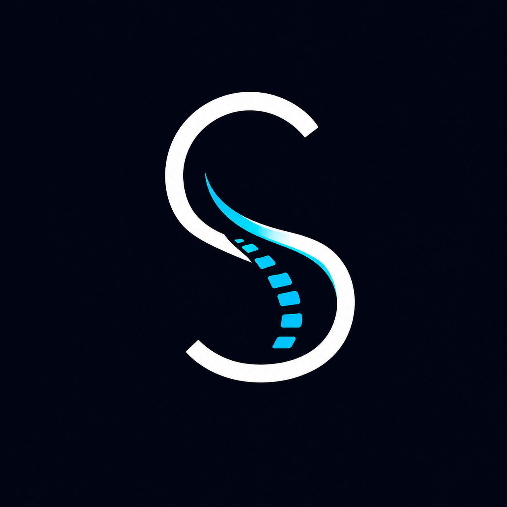
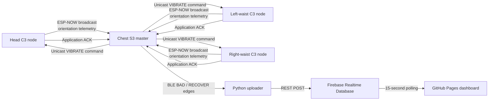

<p align="center">
  
</p>

<h1 align="center">Connected Spine</h1>

<p align="center">
  A four-node wearable prototype for posture-deviation monitoring, node-specific haptic feedback, and near-real-time digital visualisation.
</p>

<p align="center">
  <a href="Demo.mp4">Watch the demo</a> ·
  <a href="https://github.com/HCSSSSSS/ConnectedSpine/tree/v1.0-dissertation">Frozen dissertation version</a>
</p>

## Overview

Connected Spine is a distributed wearable system that monitors orientation at the chest, head, left waist, and right waist. Each node uses a BNO085 IMU and an LRA driven by a DRV2605L. A XIAO ESP32-S3 chest node coordinates three XIAO ESP32-C3 sub-nodes, evaluates deviations from a user-calibrated reference posture, and returns haptic feedback at the affected body location.

State changes are forwarded through BLE to a Python uploader, stored in Firebase Realtime Database, and displayed by a mobile-friendly web dashboard.

This repository contains the final prototype frozen for the dissertation under the annotated tag [`v1.0-dissertation`](https://github.com/HCSSSSSS/ConnectedSpine/tree/v1.0-dissertation).

> Connected Spine is an engineering prototype, not a medical device. Its reference posture and thresholds are not a clinical diagnosis or guarantee of a medically correct posture.

## System architecture



The communication design separates two types of traffic:

- Periodic IMU telemetry uses ESP-NOW broadcast without application acknowledgement. The next sample can replace a missing packet.
- Haptic commands use addressed unicast with a message ID, application ACK, retry, and duplicate suppression.

The ACK confirms that a C3 received the command. It does not confirm physical LRA onset.

## Hardware

| Location | Controller | Sensor | Haptic driver | Actuator |
|---|---|---|---|---|
| Chest/master | XIAO ESP32-S3 | BNO085 | DRV2605L | LRA |
| Head | XIAO ESP32-C3 | BNO085 | DRV2605L | LRA |
| Left waist | XIAO ESP32-C3 | BNO085 | DRV2605L | LRA |
| Right waist | XIAO ESP32-C3 | BNO085 | DRV2605L | LRA |

Both firmware targets use I2C on `D4`/`D5`. The calibration button is connected between S3 pin `D7` and GND using the internal pull-up.

## Orientation and posture logic

The firmware enables the BNO085 `GAME_ROTATION_VECTOR` report. Quaternion-derived gravity components are used to calculate pitch and roll; yaw is excluded from posture classification.

Calibration is triggered by the S3 button. The latest pitch and roll sample from each active node becomes that node's zero reference. Calibration is therefore a single-sample, user-selected reference rather than a clinically validated posture.

Pitch and roll use independent hysteresis states:

| Location | Pitch BAD | Pitch RECOVER | Roll BAD | Roll RECOVER |
|---|---:|---:|---:|---:|
| Head | 18° | 13° | 15° | 10° |
| Chest | 20° | 15° | 15° | 10° |
| Left/right waist | 20° | 15° | 15° | 10° |

Events are labelled:

- `P`: pitch deviation
- `R`: roll deviation
- `PR`: combined pitch and roll deviation
- `RECOVER`: return within both recovery thresholds

## Timing and reliability

| Setting | Value |
|---|---:|
| C3 telemetry interval | 50 ms / 20 Hz |
| S3 posture judgement interval | 200 ms / 5 Hz |
| Remote-node offline timeout | 1,000 ms |
| Vibration-command retry interval | 40 ms |
| Maximum retries | 6 |
| Per-node vibration cooldown | 2,000 ms |
| Dashboard refresh interval | 15 seconds |

The configured values describe the firmware schedule. Measured detection, reception, latency, and battery results should be reported separately rather than inferred from these constants.

## Repository structure

```text
ConnectedSpine/
├── include/
│   ├── config.h          # Node identity, thresholds and timing constants
│   └── packets.h         # ESP-NOW telemetry, command and ACK structures
├── src/
│   ├── main_s3.cpp       # Chest master, posture logic, feedback and BLE
│   └── main_c3.cpp       # Remote IMU telemetry, command ACK and vibration
├── platformio.ini        # PlatformIO environments and dependencies
├── uploader.py           # BLE-to-Firebase uploader
├── index.html            # Near-real-time dashboard
├── Demo.mp4              # Prototype demonstration
└── logo.png
```

## Build and flash

### Prerequisites

- [PlatformIO](https://platformio.org/)
- Three XIAO ESP32-C3 boards and one XIAO ESP32-S3 board
- The hardware listed above

Clone the repository:

```bash
git clone https://github.com/HCSSSSSS/ConnectedSpine.git
cd ConnectedSpine
```

### 1. Configure device identities

Before flashing, update the device-specific values:

1. In `include/config.h`, set `NODE_ID` separately for each C3:
   - `1`: head
   - `2`: left waist
   - `3`: right waist
2. In `src/main_c3.cpp`, set `MAC_S3` to the S3 station MAC address.
3. In `src/main_s3.cpp`, set `MAC_NODE1`, `MAC_NODE2`, and `MAC_NODE3` to the three C3 station MAC addresses.
4. Keep `ESPNOW_CHANNEL` identical across all four builds.

The frozen source is configured with `NODE_ID = 1`; three separate C3 builds are required.

### 2. Build the C3 firmware

Change `NODE_ID` for each target board, then build and upload:

```bash
pio run -e c3_node -t upload
```

### 3. Build the S3 firmware

```bash
pio run -e s3_master -t upload
```

The serial monitor uses `115200` baud:

```bash
pio device monitor -b 115200
```

## BLE-to-Firebase uploader

Install the Python dependencies:

```bash
python -m pip install bleak requests
```

Update `FIREBASE_URL` in `uploader.py`, then run:

```bash
python uploader.py
```

The uploader scans for `ConnectedSpine-S3`, subscribes to BLE notifications, and reconnects after disconnection. The event payload received from the S3 is:

```text
node_id,state,axis,dPitch,dRoll
```

The Firebase record adds the readable node name and a server timestamp:

```json
{
  "n": 1,
  "name": "Head",
  "e": "BAD",
  "a": "P",
  "dP": 21.3,
  "dR": 4.2,
  "createdAt": { ".sv": "timestamp" }
}
```

`requests.post()` is synchronous and uses a five-second timeout, so a slow HTTP request can temporarily block the BLE notification callback.

## Dashboard

The static dashboard in `index.html` reads up to the latest 500 Firebase events and refreshes every 15 seconds. It displays:

- recent BAD and RECOVER events;
- alert count;
- derived time within range;
- longest stable duration;
- a 12-bin event histogram; and
- rule-based suggestions derived from the most frequent node, axis, and hour.

The interface is near-real-time rather than continuously streamed. Its “latest session” represents events from the calendar date of the latest record, beginning with the first retrieved event on that date; the current schema does not contain an independent session ID.

Update the Firebase database URL in both `uploader.py` and `index.html` before deploying your own instance.

## Security and data notes

- No Firebase credentials or database-rule configuration are stored in this repository.
- The deployed Firebase rules determine whether reads and writes are protected.
- Configure least-privilege rules before collecting real data.
- The event schema does not include a person's name or demographic information, but posture records are still body-related data.
- Hardware MAC addresses in the firmware must be replaced for another installation.

## Known limitations

- No external motion-capture or reference-IMU ground truth is included.
- Calibration uses one sample without averaging or stability validation.
- Thresholds are fixed rather than personalised.
- Telemetry packets do not contain a sequence number.
- ACK confirms command receipt, not physical vibration onset.
- If a remote node goes offline while BAD, the S3 clears its internal state without emitting a RECOVER event; Firebase can retain an unmatched BAD event.
- The dashboard is polling-based, capped at 500 records, and lacks explicit session identifiers.
- Firebase upload is synchronous.
- Long-term wearability and behaviour change have not been evaluated.

## Versioning

The dissertation prototype is frozen at:

```text
tag:    v1.0-dissertation
commit: aa58291e521660fe763d99602bde13f5eb3bc49c
```

Implementation evidence does not by itself demonstrate detection performance. Quantitative results should cite the exact test branch, protocol, and raw records used.

## Author

**Chaoshuo Han**<br>
UCL CASA — Connected Environments, 2026
